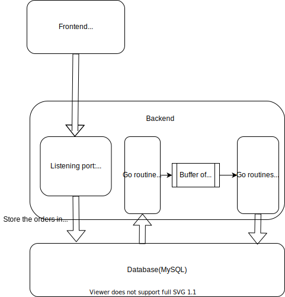
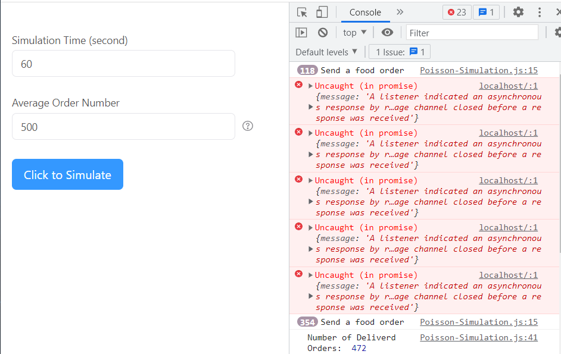
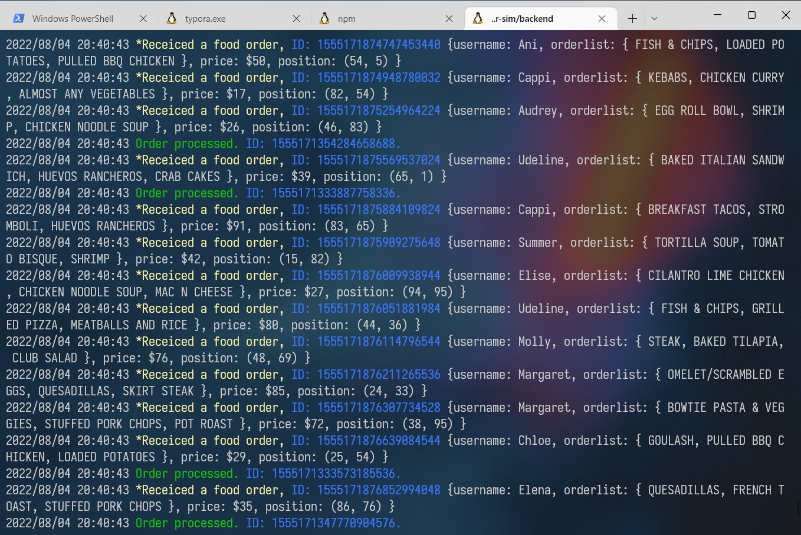

# 简易外卖派单模拟系统

这个项目是尤老师在大二下学期分配给我的，但大二下课程实在太重(自己还补修了大一的两门课)，于是就拖到了暑假来完成。这个项目是我第一次接触后端开发，上手比较困难。最开始的时候我理解错了老师的意思，做了一个简易的[客户端](https://github.com/TimeSea05/food-order-distr-client)出来(应该是骑手的客户端)，但老师想让我做的是一个模拟：模拟订单生成，然后后端根据自己的算法、前端和数据库中的数据，来给外卖员派单。一边学习并发(感谢NJU jyy老师的[公开课](http://jyywiki.cn/OS/2022/))，一边做这个项目，在一个星期之后，终于整了一个像样的demo出来。

## 1. 总体架构



前端模拟订单的生成，将生成的订单信息传送到后端监听端口。后端监听端口在接收到订单信息后，将订单信息存入数据库中。在后端有4个Goroutine(Go语言自带的协程)从数据库中取出订单，并将其放入缓冲区。同时又有32个Goroutine来处理订单，在处理订单时不停的改变外卖员(courier)的信息。

## 2. 前端

前端用泊松分布来模拟订单的生成。由于泊松分布是二项分布的极限情况，所以我们在将时间间隔调整的非常小的情况下，可以利用二项分布来近似泊松分布。

`src/App.js`中利用`rsuite`组件库搭建了一个简单的表格，在表格中输入模拟的时间`simTime`和这段时间内订单的平均值`orderNum`，即可开始模拟。

模拟订单生成的代码在`src/Poisson-Simulation.js`中。利用二项分布生成订单的思路如下：设置每一次实验的间隔为`25ms`，利用给定的模拟时间来求出实验的次数$N$。利用给定的平均值$\lambda$来求出概率值
$$
p=\frac{\lambda}{N}
$$
随后在每一次实验中，使用`Math.random()`获取一个$0\sim 1$之间的浮点数，如果这个数小于$p$，那么就向后端发送请求，否则不执行任何操作。

```js
const sendOrderReq = () => {
  if (Math.random() < prob) {
    console.log('Send a food order')
    fetch('http://localhost:8000/api/order', {
      method: 'POST',
      headers: { 'Content-Type': 'application/json' },
      credentials: 'include',
      body: JSON.stringify(getRandomOrder())
    })

    count++
  }
}
```

`src/random-lib.js`中存放的是生成随机订单的代码。订单包含以下四个部分：

* username
* orderlist(用户点的餐)
* price
* position(用户当前所在位置)

## 3. 后端

### 3.1  监听：来自前端的订单信息

后端使用的HTTP框架是[fiber](https://github.com/gofiber/fiber)。接收到前端的订单信息后，调用`utilities.GenSnowFlakeID`为每个订单生成一个唯一的ID，并将其存入数据库中。

**监听部分：**

```go
app := fiber.New()
app.Use(cors.New(cors.Config{
	AllowCredentials: true,
}))

app.Post("/api/order", controllers.OrderLogger)
app.Listen(":8000")
```

**Handler:**

```go
func OrderLogger(c *fiber.Ctx) error {
	var data map[string]string

	if err := c.BodyParser(&data); err != nil {
		return err
	}

	order := models.Order{
		ID:        utilities.GenSnowFlakeID(),
		Username:  data["username"],
		OrderList: data["orderlist"],
		Price:     data["price"],
		Position:  data["position"],
	}

	log.Printf("\033[1;33m*Receiced a food order, \033[1;34mID: %d\033[0m %s", order.ID, order.String())

	database.DB.Create(&order)

	return c.JSON(order)
}
```

### 3.2  处理订单

当后端拿到一个订单后，我们要做的事情就是要从数据库中选出一个外卖员，并将这个订单分配给他。分配的算法比较简单，只需要找到离订单产生位置最近的外卖员即可。

首先我们遇到一个问题：数据库中的外卖员数量那么多，我们如何迅速找出距离最近的外卖员？

一个非常简单但是实际不可行的方案是把数据库的所有外卖员都加载到一个数组中，然后遍历这个数组，找到符合条件的外卖员。但是当外卖员数量非常大的时候，这个方案明显不可行。我采用的办法受到Uber的启发，将整个地图分成多个片区(我用的地图是$100\times 100$，$20 \times 20$一个街区，共25个块)，每接到一个订单时，就根据订单的位置确定分区的ID，在指定的分区中寻找与其距离最近的且闲暇的外卖员。

```go
// currently we suppose that we can find available couriers in each block
// TODO: deal with the case that there is no couriers in certain block
var couriers []models.Courier
database.DB.Find(&couriers, "block_id = ?", userBlockID)
var selectedCourier models.Courier = couriers[0]

// TODO: the credit of couriers should also be taken into consideration
// when selecting couriers
for _, courier := range couriers {
	isDistShorter := calcDist(order.Position, courier.Position) < calcDist(order.Position, selectedCourier.Position)
	if courier.IsAvailable && isDistShorter {
		selectedCourier = courier
	}
}
```

之后外卖员处于忙碌状态，位置会不断的改变(但我们只能在后端模拟其位置的改变)。其位置改变的同时，分区的ID也可能会发生变化，所以需要不停的对外卖员的信息进行更新。此处我们假定外卖员只会走直角路线。

```go
// Since we have selected this courier, this courier is
// no longer available
database.DB.Model(&models.Courier{}).Where("name = ?", selectedCourier.Name).Update("is_available", 0)

// When the server has selected the courier,
// the courier then need to go to the position of user
// In fact, the courier need to go to the position of restaurant,
// then go to the position of user,
// but for simplicity, now we omit the factor of restaurant
currentPos := selectedCourier.Position
for currentPos != order.Position {
	updatePosition(&currentPos, order.Position)
	database.DB.Model(&models.Courier{}).Where("name = ?", selectedCourier.Name).Update("position", currentPos)
	database.DB.Model(&models.Courier{}).Where("name = ?", selectedCourier.Name).Update("block_id", mapPosToBlockID(currentPos))
	time.Sleep(time.Millisecond * 250)
}

// The current order finished. The selected courier is also free now
database.DB.Model(&models.Courier{}).Where("name = ?", selectedCourier.Name).Update("is_available", 1)
log.Printf("\033[1;32mOrder processed. \033[1;34mID: %d.\033[0m", order.ID)
```

### 3.3  并发：提高效率

Go语言在语言层面上为并发提供了支持，这也是为什么这个项目的后端选择Go语言。

在这个项目中，我使用了生产者-消费者的同步模型。创建了4个goroutine从数据库中取出订单，放到buffer中(使用Go语言的Channel实现)，并创建32个goroutine从buffer中取出订单，进行处理。

```go
func RunProcessOrderTask() {
	for i := 0; i < 4; i++ {
		wg.Add(1)
		go getOrder()
	}

	for i := 0; i < 32; i++ {
		wg.Add(1)
		go processOrder()
	}

	wg.Wait()
}
```

从数据库取出订单的4个goroutine在取订单时会发生数据竞争(取出订单包含两个操作：获得订单和删除订单，如果不加保护，那么可能导致buffer中出现两个相同的订单)，所以要加一把互斥锁：

```go
var orderChannel = make(chan models.Order, 64)
var wg sync.WaitGroup
var mutex sync.Mutex

for {
	// Take a order from the database, then put it into the channel
	// When there is no order in the database, then wait
	// Do remember to delete it from the database
	mutex.Lock()
	var order models.Order
	if database.DB.First(&order).Error != nil {
		mutex.Unlock()
		continue
	}

	orderChannel <- order
	database.DB.Model(&models.Order{}).Where("id = ?", order.ID).Delete(&order)
	mutex.Unlock()
}
```

## 4. 运行效果

**前端：**



**后端：**


